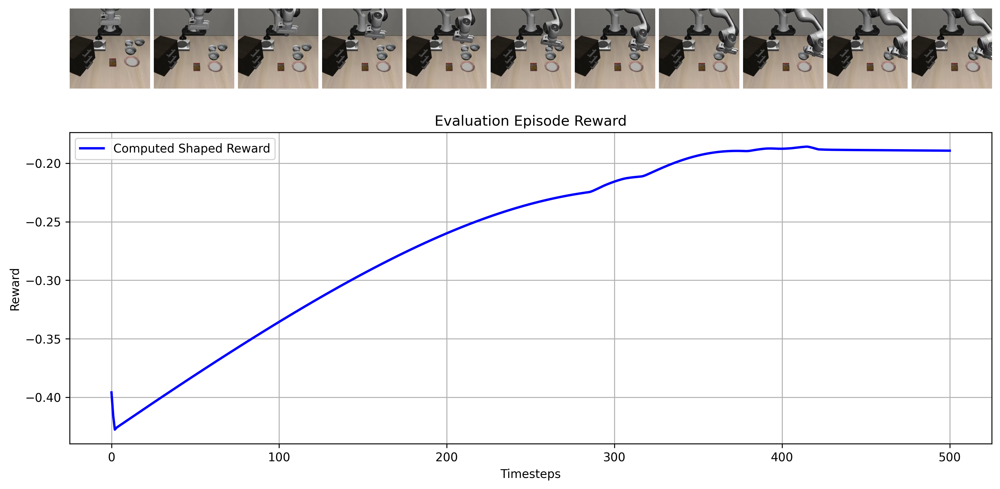

# HW3: RL Finetuning with ACTs

Action Chunking Transformer (ACT).

You can complete the homework by modifying the provided files. You will be finetuning a given ACT policy using several different RL methods. The ACT model we will be using is the ACT from [lerobot](https://github.com/huggingface/lerobot/tree/main/src/lerobot/policies/act).

As a preface, many areas are very new in research. As such, there is no clear cut way of doing things. You are encouraged to look and cite relevant papers in your report. Evaluation will be based on the quality of your report and the explanations provided. Code will also be evaluated based on the correctness of certain parts of your implementation (e.g. resetting the environment properly in GRPO).

### Model Architecture

You will be provided with a pretrained ACT model, which is available at `huggingface / mila cluster`. 

# RL Finetuning 

After pretraining a model, RL finetuning is a method to improve the model's performance on a specified task. 

RL is preferred when optimal actions cannot be obtained from demonstrations, such as fine-grained control or other difficult to perform tasks. 

In this section, the goal is to compare training results when using two different finetuning strategies:  

## RLHF with PPO

In this section, we will explore PPO. Standard RL uses a value function `V` trained on the reward function `R(s, a)` to estimate the expected return from a state-action pair. We will have to modify our architecture from `hw2` to accommodate for both.

### PPO objective:

In order to do so, we will modify the architecture by attaching a value head at the end of the transformer and finetune it. Explain your architecture modification choice.

### Evaluation [x pts]

Create a figure using your best model, where the top row are sampled frames, and plot the trained value function as well as the provided reward function on those sampled states. An example of a rollout and its reward plot is shown below:

Repeat this visualization for each of the remaining sections of the homework.

## RLHF with GRPO

As you may have noticed, training a value function estimation may not be easy. Next we will implement GRPO, a method that finetunes policies that do not explicitly model a value function. GRPO was first popularized in LLMs due to this property, since LLMs only model the policy. We will explore two different methods of grouping. 

A core part of GRPO is grouping trajectories that start from an initial starting state. We will first cheat by resetting the simulation to the same initial, before utilizing our results from `hw2` to generate trajectories.

### GRPO with ground truth resets (cheating)

A standard method for LLMs is to generate different rollouts starting from the same initial state. 

Explain in the report how the sampled trajectories differ from one another, and how the loss is calculated.

### GRPO in world models

Using the results from homework 2, we can train a world model to predict the next state given the current state and action. Then, we can label the trajectories and use them to update our policy. 

Report the trajectory length generated by the world model, as well as how they are used in training (e.g. how you decide to bootstrap them). Explain how the reward signal is provided, and how that might cause issues during training.

## Tips:

1. If you are having trouble training the model and not running out of memory, use a smaller batch size and gradient accumulation. Training will take a little longer but it should work.

# Submitting the code and experiment runs

In order to turn in your code and experiment logs, create a folder that
contains the following:

-   A folder named `data` with all the experiment runs from this assignment. **Do not change the names originally assigned to the folders, as specified by `exp_name` in the instructions. Video logging is not utilized in this assignment, as visualizations are provided through plots, which are outputted during training.**

-   The `roble` folder with all the `.py` files, with the same names and directory structure as the original homework repository (excluding the `data` folder). Also include any special instructions we need to run in order to produce each of your figures or tables (e.g. "run python myassignment.py -sec2q1" to generate the result for Section 2 Question 1) in the form of a README file.

As an example, the unzipped version of your submission should result in the following file structure. **Make sure that the submit.zip file is below 15MB and that they include the prefix `act/...`, `data/q1_`, `data/q2_`, `data/q3_`, etc.**

If you are a Mac user, **do not use the default "Compress" option to create the zip**. It creates artifacts that the autograder does not like. You may use `zip -vr submit.zip submit -x "*.DS_Store"` from your terminal.

Turn in your assignment on Gradescope. Upload the zip file with your code and log files to **HW Code**, and upload the PDF of your report to **HW**.

